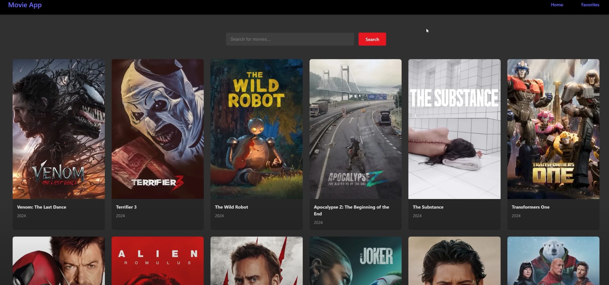
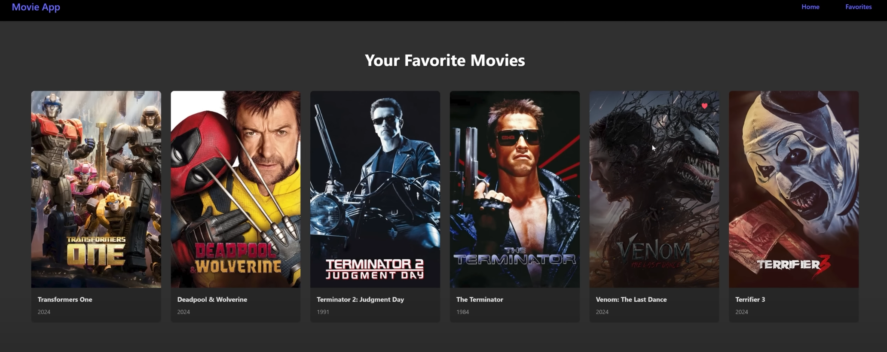

# Movieddict

Movieddict- An online search tool that allows all movie buffs out there to browse through a list of publicly released Hollywood movies. Tired of constantly searching for that beloved movie? Rest assured - the "favourite button" feature allows you to view all "favourited" movies in a single space.

&nbsp;
&nbsp;
&nbsp;

## Getting Started!

1. Head over to the [TMDB](https://www.themoviedb.org/) page and create an account for an API key.
2. Install all the dependencies listed in package.json in your React project.
3. Substitute your API ID and Key in the following URL in api.js located in  > services folder
   >

     const response = await fetch(`${BASE_URL}/movie/popular?api_key=${API_KEY}`);
## Upcoming Features
1. Users will be alllowed to create personal accounts which facilitates access of "Favourite movies" list on multiple devices.
2. Addition of a "Genre" tab which will allow users to search for all relevant films grouped under a specific genre.
